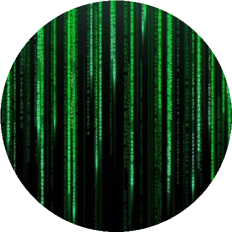
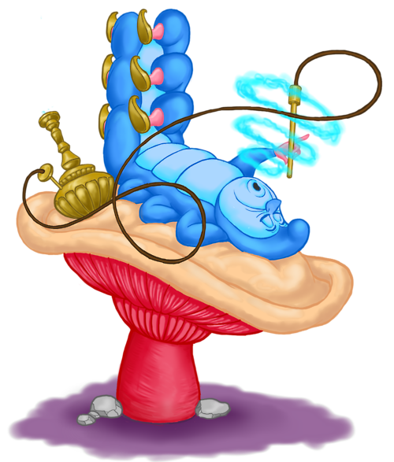
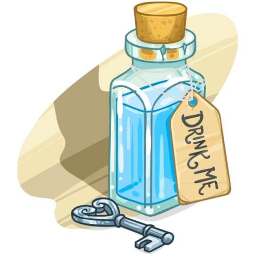

    

    

<h1 align="center">
    
</h1>

<h3 align="center">I am a passionate student, hacker & web3 enthusiast from NSW, Australia 🇦🇺</h3>

 

 I recently completed the [**24-week online Fintech Bootcamp via EdX & Sydney Uni**](https://techbootcamp.sydney.edu.au/fintech/). The course was 240 hours & I loved every minute of it! I graduated in the top percentile.
View my certificate of completion [here](./docs/bootcamp_certificate.pdf).

 I’m currently taking Dr Angela Yu's [**100 Days of Code: The Complete Python Pro Bootcamp for 2023**](https://www.udemy.com/course/100-days-of-code/) course on Udemy to reinforce my skills.

 I plan on taking Dr Yu's [**The Complete 2023 Web Development Bootcamp**](https://www.udemy.com/course/the-complete-web-development-bootcamp/) next to familiarise myself with the fundamentals of web development.

 I'm Interested in all aspects of development, particularly blockchain security & full stack Web3. I have never been a gamer but I like the idea of building games. I am self educating my way to eventually begin learning **Rust** so I can learn to build Dapps on [**Stellar**](https://stellar.org/)'s new smart contracts platform, [**Soroban**](https://soroban.stellar.org/) & contribute to building a new financial paradigm.

 Ask Me About **Coding, Web3, Coffee, Music or how to escape the Matrix** [here](https://github.com/hiddenciphers/hiddenciphers/issues)

 **I began my programming journey at age 37 in March of 2023** purely to pass the time during the bear market & sharpen my blockchain knowledge, which up until that point came directly from Youtube over the previous 4 years. I never anticipated that I would discover a new passion in the form of coding! I have always been creative & love to challenge myself to constantly learn new things, which is why I think I have fallen in love with programming. I have now decided to dedicate the majority of my personal time to self educate in this field which by default involves an **eternal quest for knowledge**.

 

 

 
  
  
  
  
    
  

    
  

<h2 align="center">Languages-Frameworks-Tools</h2>
 

     
     
    

 

  <h2>My Contributions </h2>
   
  
     

<h2 align="center"> Stats </h2>
 

  
  
   
  

  

<h3 align="center">
    
      
    
</h3>

 
